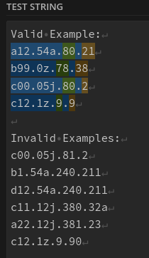
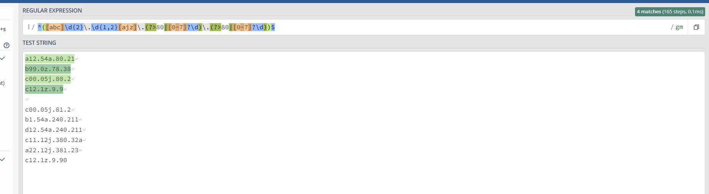
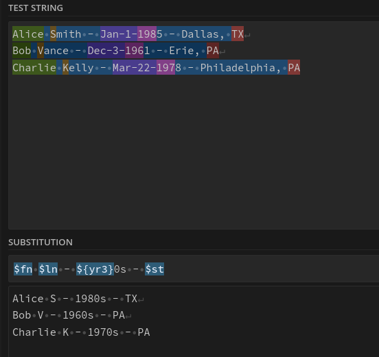
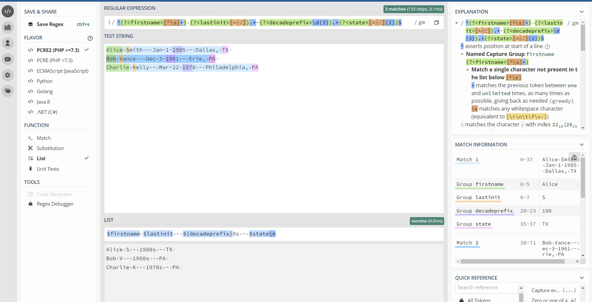

### Assignment 1 Description: Regex Writing/Optimization (60 pts)

Regular Expressions can be written in a myriad of ways. Some are very fast, some are exceptionally slow. This matters a lot when processing a huge amount of log/machine data. Your task: Try to write a regex to parse the data described below in as performant a way as possible.

Write a regex that correctly identify and capture values that meet the specification:

1. Data is broken into four period-delimited "octets" (like an IP address)
2. First octet must start with a letter in the set {a, b, c} and have precisely 2 digits following
3. Second octet must be a number followed by a letter in the set {a, j, z} - number can be between 0 and 99 with or without leading zeros
4. The last two fields are numbers <= 80 (may be single digit)
5. values are the only data on each line

Valid Example:
a12.54a.80.21
b99.0z.78.38
c00.05j.80.2
c12.1z.9.9

Invalid Examples:
c00.05j.81.2
b1.54a.240.211
d12.54a.240.211
c11.12j.380.32a
a22.12j.381.23
c12.1z.9.90

In my validation, you can see a screenshot here:



Convenient place to test is: [https://regex101.com/](https://regex101.com/)

It also gives performance characteristics... for example mine takes 166 (down from 222!) steps. Can you do better?


## Approach

200 Steps:

`([abc]\d{2}\.\d{1,2}[ajz]\.((80)|([0-7]?\d))\.((80)|([0-7]?\d)))$`

176 steps:

`^([abc]\d{2}+\.\d{1,2}+[ajz]\.(?:80|[0-7]?\d)\.(:?80|[0-7]?\d))$`
171 steps:

`^([abc]\d{2}+\.\d{1,2}+[ajz]\.(?:80|[0-7]?\d)\.(?:80|[0-7]?\d))$`

171 steps:

`^([abc]\d{2}+\.\d{1,2}+[ajz]\.(?:80|[0-7]\d|\d)\.(?:80|[0-7]\d|\d))$`

173 steps, reversing order of "rare" 80 and "common" 0-79 based on recommended techniques. Didn't help.

`^([abc]\d{2}+\.\d{1,2}+[ajz]\.(?:[0-7]?\d|80)\.(?:[0-7]?\d|80))$`

182 steps (by using `{2}` for last octet pattern instead of repeating. didn't help)

`^([abc]\d{2}+\.\d{1,2}+[ajz](?:.80|.[0-7]?\d){2}+)$`

196 steps (by "factoring out" the `\.` rather than repeating it. didn't help.)

`^([abc]\d{2}+\.\d{1,2}+[ajz](<?:.(?:[0-7]?\d|80)>){2}+)$`

178 steps (by reversing order of 80 and 0-79):

`^([abc]\d{2}+\.\d{1,2}+[ajz](?:.[0-7]?\d|.80){2}+)$`

194 steps:

`^([abc]\d{2}+\.\d{1,2}+[ajz](<?:.(?:80|[0-7]?\d)>){2})$`

195 steps:

`^([abc]\d{2}+\.\d{1,2}+[ajz](?:.80|.[0-7]\d|.\d){2})$`

Techniques for optimizing regex: https://www.loggly.com/blog/five-invaluable-techniques-to-improve-regex-performance/

OVERALL GOAL WITH REGEX OPTIMIZATION: MINIMIZE BACKTRACKING.

#### Aha!

165 steps and 0.1ms (1/10th the time)!!! Using atomic groups for the last two octets (backtracking disallowed).
https://www.regular-expressions.info/toolong.html

`^(?>[abc]\d{2}\.\d{1,2}[ajz]\.(?>80|[0-7]?\d)\.(?>80|[0-7]?\d))$`



### Assignment 2 Description: Regex (60 pts)

Imagine we have data in the format of:

```
Alice Smith - Jan-1-1985 - Dallas, TX
Bob Vance - Dec-3-1961 - Erie, PA
Charlie Kelly - Mar-22-1978 - Philadelphia, PA
```

Using a tool like sed or regex101.com, try to remove some specific information (imagine needing to consume data but to anonymize some of it):

```
Alice S - 1980s - TX
Bob V - 1960s - PA
Charlie K - 1970s - PA
```

A screenshot of professor Hays's approach can be seen below.


#### Solution

```
^(?<firstname>[^\s]+) (?<lastinit>[A-Z]).*-(?<decadeprefix>\d{3}).*(?<state>[A-Z]{2})$
```

Performance: 3 matches (135 steps, 0.1ms)

Replacement string: `$firstname $lastinit - ${decadeprefix}0s - $state\n`


